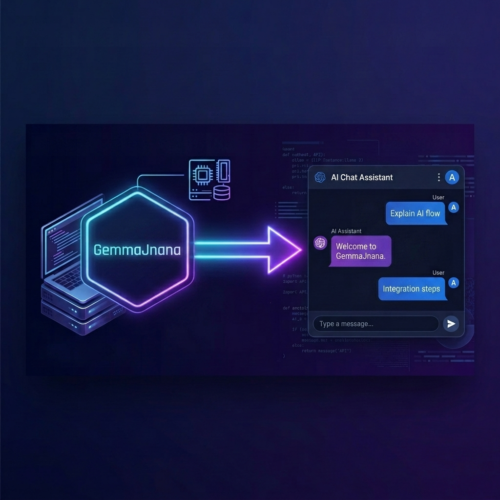
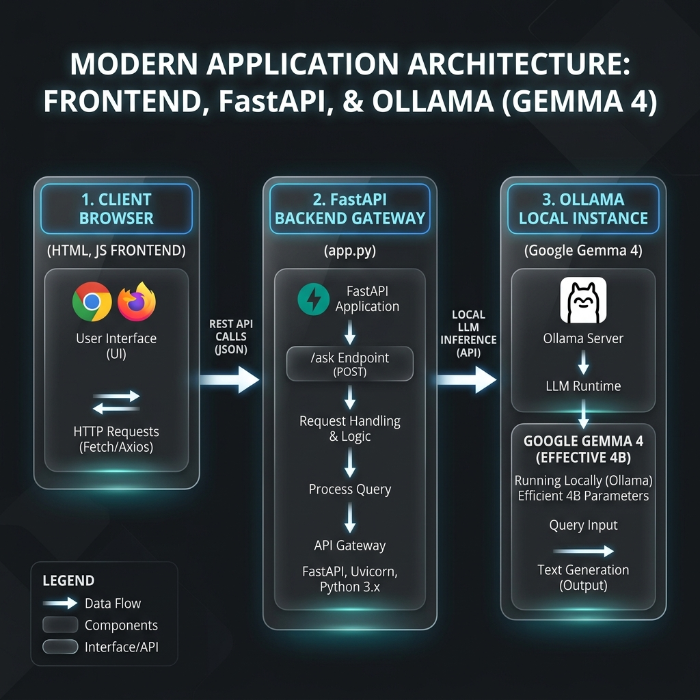
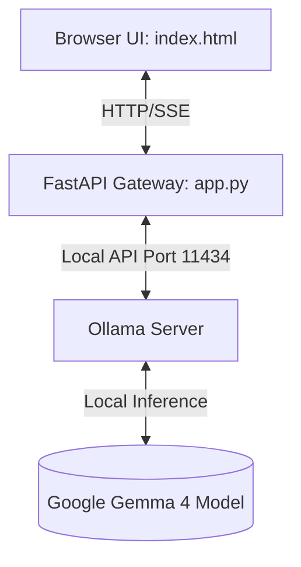

# GemmaJnana



A local development stack to download, serve, and interact with Google's **Gemma 4 (Effective 4B)** model using **Ollama** and a **FastAPI** gateway. The package comes with a beautiful, fully animated chat playground UI.

---

## Project Architecture Flow

Below is the visual flow of the GemmaJnana local architecture.



### Data Flow Diagram



### Components Description

*   **`start.sh`**: The master automation script. It:
    1. Checks if Ollama is installed and automatically updates it to the latest version if needed.
    2. Starts the Ollama service.
    3. Verifies and pulls the `gemma4:e4b` model.
    4. Launches the FastAPI server in the background.
    5. Serves the web interface in the foreground.
*   **`stop.sh`**: Gracefully terminates all background servers (Ollama, FastAPI app, and the lightweight HTTP server).
*   **`app.py`**: A clean, single-file FastAPI gateway that uses the official `ollama` Python SDK to expose endpoints for health checks (`/health`), text completions (`/chat`), and SSE-based chunk streaming (`/chat/stream`).
*   **`index.html`**: A premium dark-themed web playground featuring custom typography, responsive design, a bottom-anchored text input, and a pulsing blinking loader indicator.

---

## What you can and cannot do

Before running the application, it is important to understand what local LLMs are good at and where they fail:

| What you CAN do with Local LLMs | What you CANNOT do with Local LLMs |
| :--- | :--- |
| **Complete Privacy**: Since everything is running on your machine itself, your private code, emails, or personal data never goes to any server outside. | **High speed on old hardware**: If your laptop does not have minimum 8GB/16GB RAM or GPU cores (like Apple Silicon or Nvidia), the response will be very slow. |
| **Works 100% Offline**: You can use the model on a flight, train, or when your wifi is down. No active internet is needed after downloading the model. | **Live web search**: The model does not connect to the internet to search Google, so it cannot answer about current news or live sports scores. |
| **Zero Bills**: There is no token cost or monthly subscription. It is fully free of cost. | **Handling massive documents**: Small local models have limited memory (context window) and will forget details if the chat becomes too long. |
| **Fast testing**: You can tweak python backend parameters or system instructions as much as you want without worrying about API limits. | **Very complex logic**: Small models (like 4B parameters) are amazing for normal coding support and general writing, but they struggle with complex math or heavy logic tasks. |
| **Generate text and code**: Write summaries, emails, clean python scripts, and format tables easily. | **Generate images directly**: These local LLMs are text-only. They cannot generate images or diagrams directly (you need separate diffusion models for that). |

---

## Prerequisites

To run this application, make sure you have:
1.  **macOS** (since automated updates look for `/Applications/Ollama.app`).
2.  **Python 3.x** with the required libraries:
    ```bash
    pip install fastapi uvicorn ollama
    ```

---

## How to Run

1.  **Start the entire service stack**:
    ```bash
    ./start.sh
    ```
    This script will take care of updating Ollama, downloading the model, and launching the servers.

2.  **Open the Web Playground**:
    Navigate to [**`http://localhost:8080`**](http://localhost:8080) in your browser.

3.  **Graceful shutdown**:
    To shut down the web server, press `Ctrl+C` in your terminal. Alternatively, to ensure all background processes (FastAPI, Ollama) are stopped, run:
    ```bash
    ./stop.sh
    ```

---

## API Reference

The FastAPI gateway runs at `http://127.0.0.1:8000` and offers the following endpoints:

*   `GET /health`: Diagnoses connection health and returns active model metadata.
*   `POST /chat`: Completes message requests (non-streaming).
*   `POST /chat/stream`: Initiates an SSE (`text/event-stream`) chat channel.
